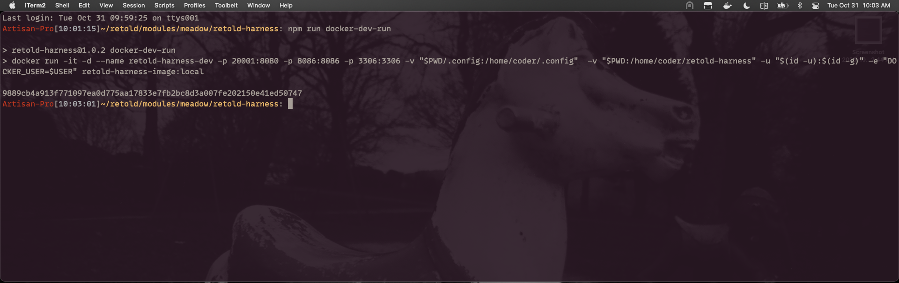
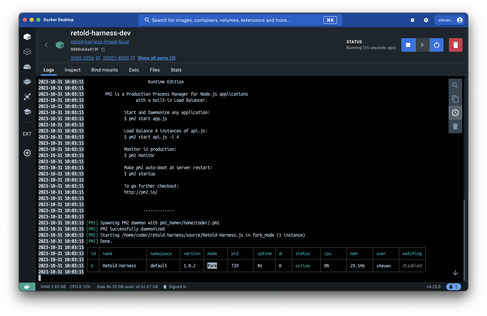
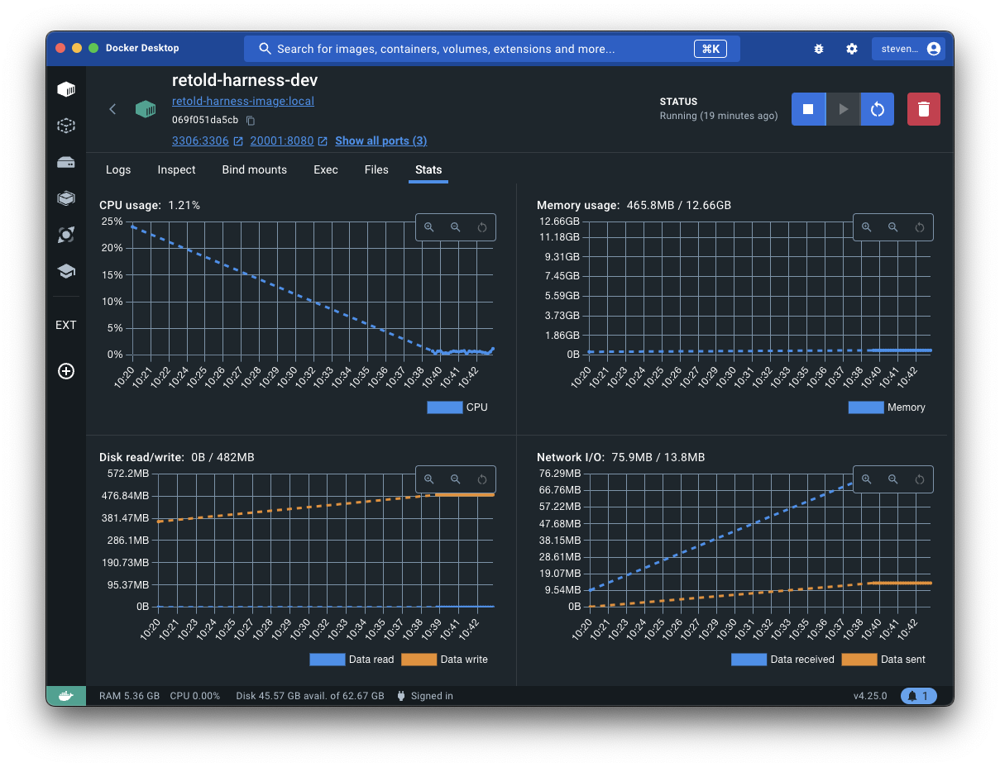

# Retold Harness

A basic set of API endpoints that contains Books, Authors, Joins and links to 
images for the cover of each book.  Useful for more complex harnesses.  

Entirely self-contained.

## Getting up and Running

This package requires Docker to be installed on your workstation.  You can get 
things running by typing the following commands:

### 1) Clone the code from github:

```
git clone https://github.com/stevenvelozo/retold-harness
```


### 2) Build the docker image:

_This can take a bit of time, depending on your connection speed and resources._

```
npm run docker-dev-build
```


### 3) Create and launch the docker container:

_This can also take a bit of time....._

```
npm run docker-dev-run
```






## After the docker container is running there is quite a bit available:

* a REST web API serving JSON on port 8086
* a browser-based visual studio code environment ready to run node applications
* a mariadb instance, preloaded with 10,000 Book records joined to their Author records
* a partridge
* a pear tree

### This all fits in less than 500 meg of RAM, and uses virtually no processor power



### Some REST API Examples

The REST endpoints are provided by the [meadow-endpoints](https://www.npmjs.com/package/meadow-endpoints) library on NPM.  Some examples of queries you can make:

## List the first 100 Books in the database: (http://localhost:8086/1.0/Books/0/100)


## Get the book with `IDBook` 1: (http://localhost:8086/1.0/Book/1)

You will notice that when requesting a single book, there is an `Authors` array populated with the connected authors for the particular book.  But in the list, the array was not filled out.  This is because in meadow-endpoints there is a post-operation behavior hook only attached to the read single record endpoint.  This is reflected in the `/source/Retold-Harness.js` code file in lines 14-41.


## List the first 10 Authors in the database whose name begins with `Susan`:  (http://localhost:8086/1.0/Authors/FilteredTo/FBV~Name~LK~Susan%25/0/10)

