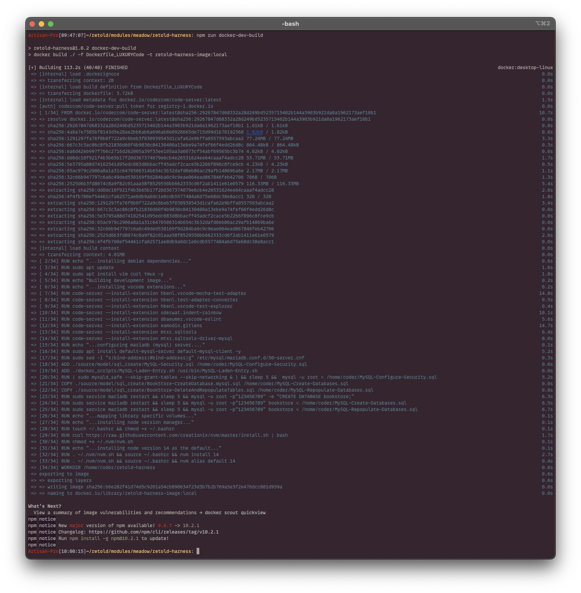
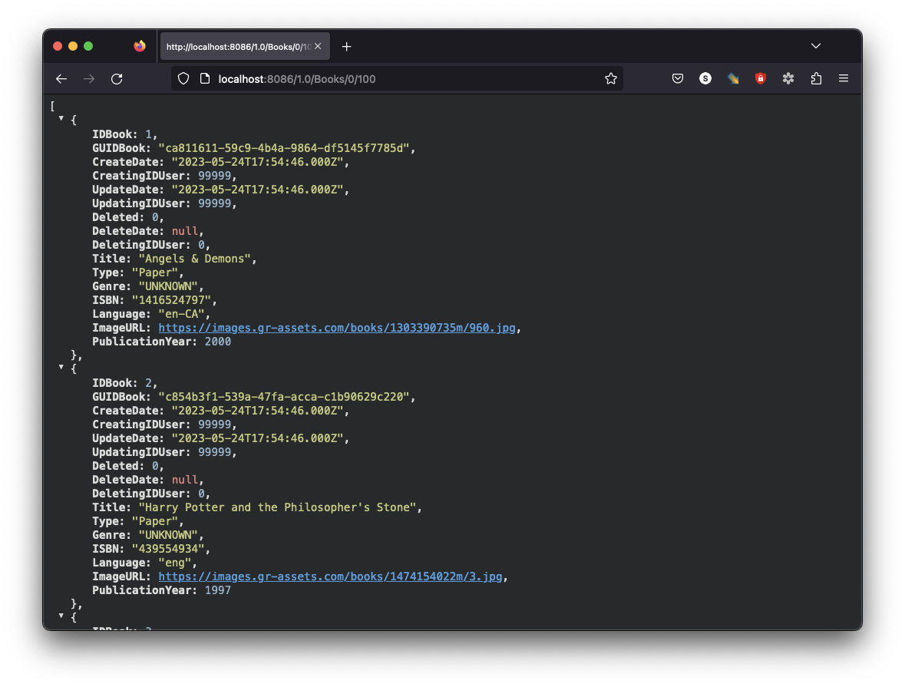
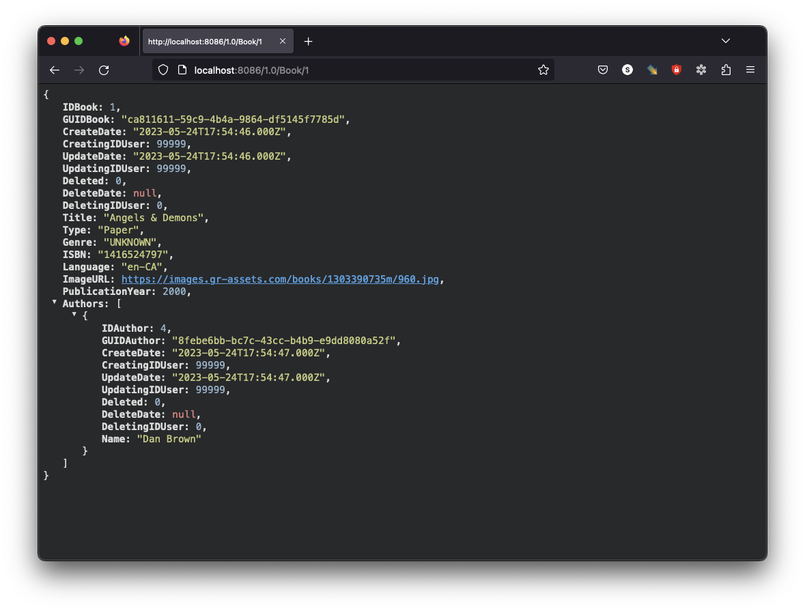
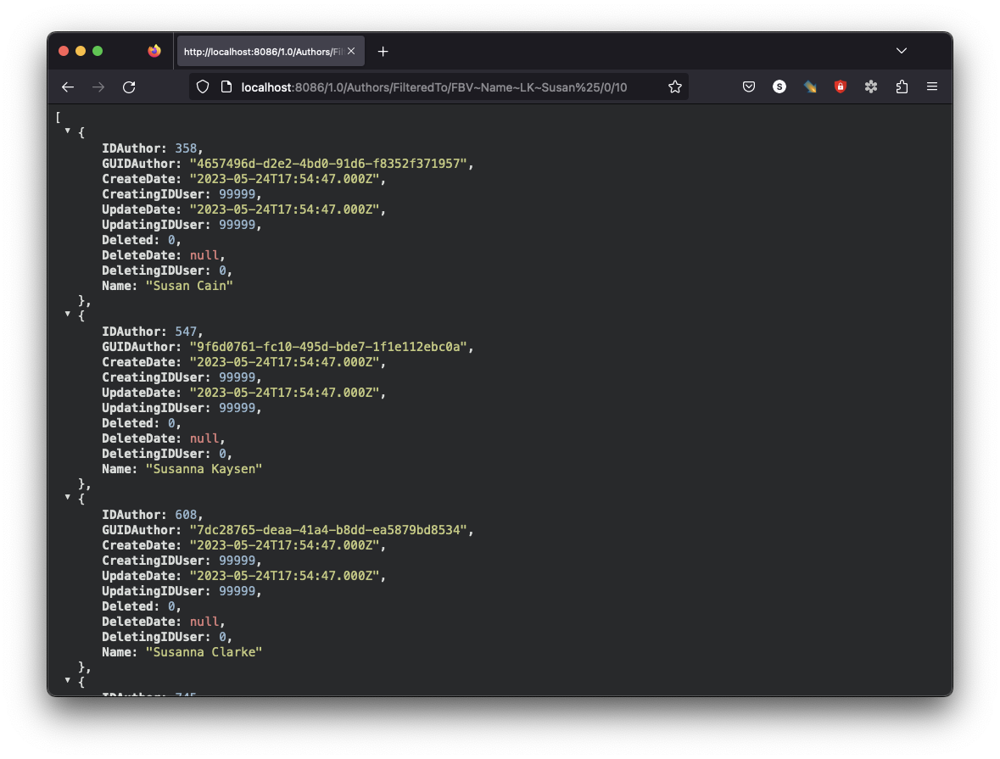
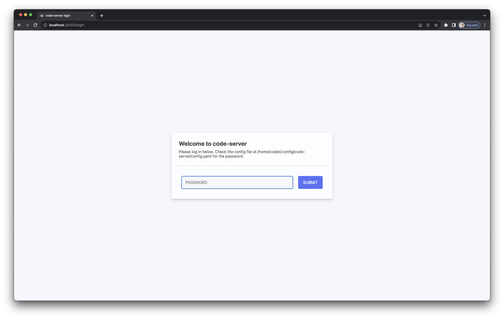
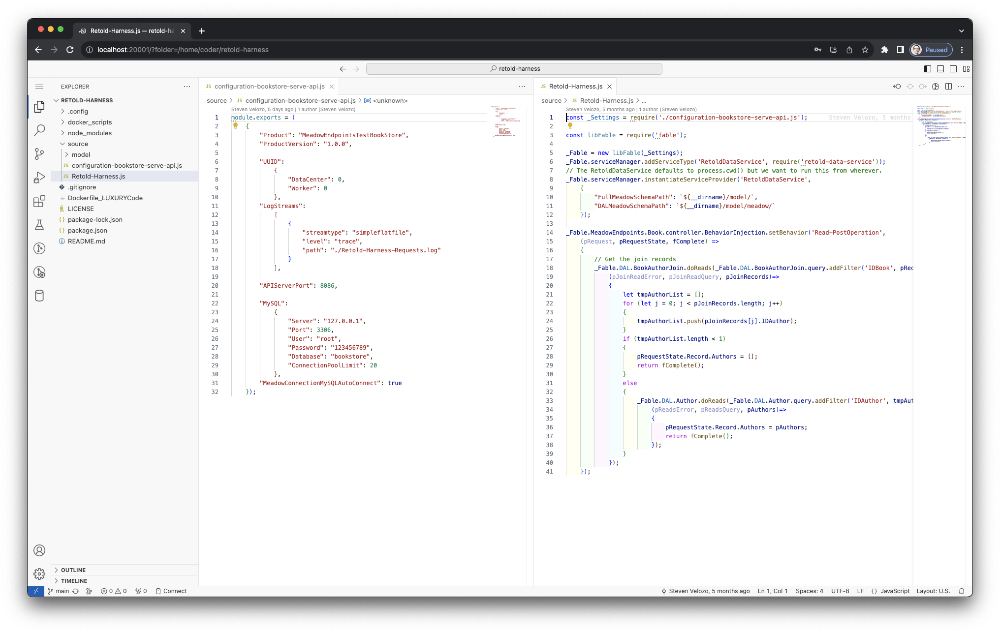
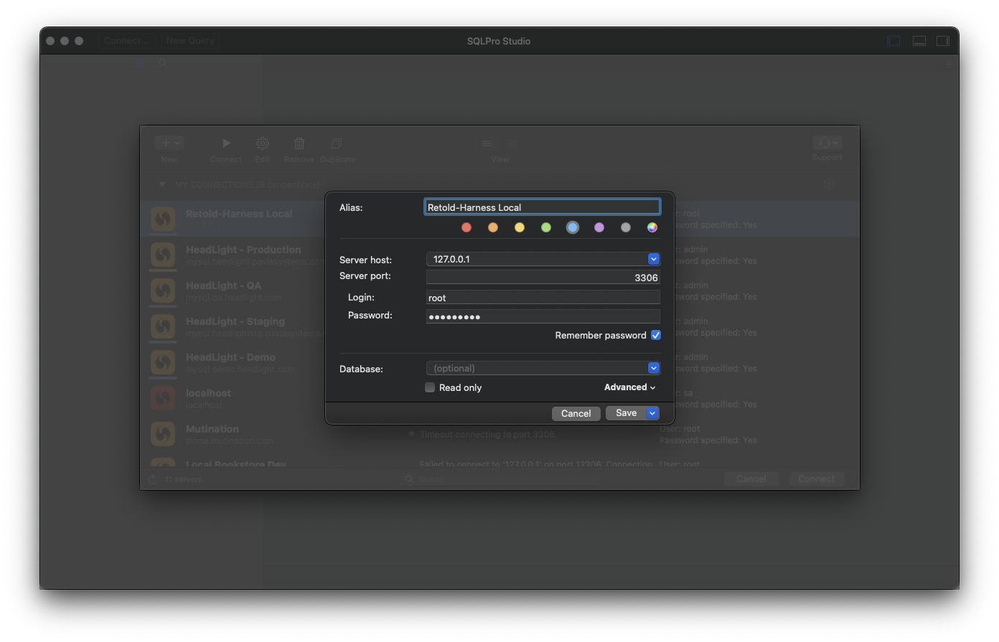
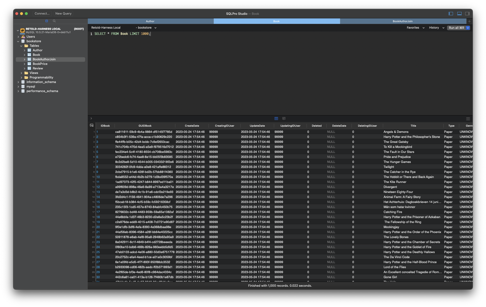

# Retold Harness

> A self-contained REST API harness for the Retold framework

Retold Harness brings together the full Retold stack into a running bookstore application.  Point a browser at `http://localhost:8086/1.0/Books/0/100` and you have a working REST API backed by 10,000+ book records, author joins, pricing, store inventory, and reviews -- all auto-generated from a Stricture DDL.

## Features

- **8-Entity Bookstore Model** - Users, Books, Authors, Joins, Prices, Stores, Inventory, and Reviews
- **Auto-Generated CRUD** - Every entity gets Create, Read, Reads, Update, Delete, Count, Schema, and New endpoints
- **Author Enrichment** - Single Book reads include an Authors array via behavior injection
- **Pre-Loaded Data** - 10,000+ book records with associated authors for realistic testing
- **Docker Containerized** - MariaDB database and API server in a single container
- **Luxury Code IDE** - Browser-based VS Code for in-container development
- **SQLite Testing** - In-memory test suite requires no external database

## Quick Start (Docker)

```bash
git clone https://github.com/stevenvelozo/retold-harness
cd retold-harness
npm run docker-dev-build
npm run docker-dev-run
```

The REST API is now at `http://localhost:8086`.



## Quick Start (Manual)

```bash
# Start a MariaDB container
docker run -d --name mariadb -p 3306:3306 \
  -e MARIADB_ROOT_PASSWORD=123456789 \
  -e MARIADB_DATABASE=bookstore \
  mariadb:latest

# Create the tables
cat ./source/model/mysql_create/MeadowModel-CreateMySQLDatabase.mysql.sql \
  | docker exec -i mariadb mariadb -u root -p123456789 bookstore

# Install and start
npm install
npm start
```

Alternatively, if using a true MySQL image:

```bash
cat ./source/model/mysql_create/MeadowModel-CreateMySQLDatabase.mysql.sql \
  | docker exec -i mariadb mysql -u root -p123456789 bookstore
```

## Architecture

```
Retold Harness
  ├── Retold Data Service
  │     ├── Orator + Restify (HTTP Server, port 8086)
  │     ├── Meadow (DAL for each entity)
  │     │     └── Provider (MySQL / SQLite)
  │     └── Meadow Endpoints (REST Routes)
  │           └── Behavior Injection (Author enrichment)
  ├── Data Model (8 entities from Stricture DDL)
  └── Docker Environment
        ├── MariaDB (pre-loaded bookstore database)
        └── Luxury Code (browser VS Code, port 20001)
```

## REST API Examples

### List the first 100 books: `http://localhost:8086/1.0/Books/0/100`



### Get a single book with authors: `http://localhost:8086/1.0/Book/1`

When fetching a single book, the response includes an `Authors` array populated via the behavior injection hook in `source/Retold-Harness.js`.  In the multi-record list, the array is not included because the hook is only on the singular Read endpoint.



### Filter authors by name: `http://localhost:8086/1.0/Authors/FilteredTo/FBV~Name~LK~Susan%25/0/10`



### Count books by genre

```
GET http://localhost:8086/1.0/Books/Count/FilteredTo/FBV~Genre~EQ~Science Fiction
```

## Data Model

| Entity | Columns | Description |
|--------|---------|-------------|
| User | 8 | System user accounts |
| Book | 16 | Books with title, genre, ISBN, language, cover image |
| Author | 11 | Authors with name and optional user link |
| BookAuthorJoin | 4 | Many-to-many join between Books and Authors |
| BookPrice | 15 | Pricing periods with discount and coupon support |
| BookStore | 15 | Physical store locations with address |
| BookStoreInventory | 16 | Stock levels per book per store |
| Review | 13 | User reviews with text and rating |

## Docker Services

| Port | Service |
|------|---------|
| 8086 | REST API |
| 31306 | MariaDB (mapped from 3306) |
| 20001 | Luxury Code (VS Code in browser) |

### Database Credentials

| Setting | Value |
|---------|-------|
| User | `root` |
| Password | `123456789` |
| Database | `bookstore` |

## Luxury Code

Luxury Code provides a browser-based VS Code environment inside the Docker container.  Open `http://localhost:20001` after launching the container.  Password: `luxury`





## MySQL

The Docker image exposes a MariaDB server.  Connect with your tool of choice using the credentials above.





## Source Code

The harness is intentionally minimal:

- `source/Retold-Harness.js` (47 lines) -- Initializes Fable, creates the data service, installs the Author enrichment hook
- `source/configuration-bookstore-serve-api.js` (41 lines) -- Configuration with MySQL connection details and server port
- `source/model/` -- Compiled Stricture model, DDL source, SQL scripts, and sample data

## Building the Model

To recompile the DDL after schema changes:

```bash
npm run build-model
```

## Testing

```bash
npm test
```

The test suite contains 90 tests covering all 8 entities, behavior injection, DAL access, filtering, pagination, and soft deletes.  Tests use in-memory SQLite and require no external database.

## Documentation

Detailed documentation is available in the `docs/` folder and can be served locally:

```bash
npx docsify-cli serve docs
```

## Customizing

All ports, passwords, and configuration are in `source/configuration-bookstore-serve-api.js` and `package.json`.  Docker port mappings are in the npm scripts.

## Related Packages

- [retold-data-service](https://github.com/stevenvelozo/retold-data-service) - All-in-one data service
- [meadow](https://github.com/stevenvelozo/meadow) - Data access layer and ORM
- [meadow-endpoints](https://github.com/stevenvelozo/meadow-endpoints) - Automatic REST endpoint generation
- [foxhound](https://github.com/stevenvelozo/foxhound) - Query DSL for SQL generation
- [stricture](https://github.com/stevenvelozo/stricture) - Schema definition language
- [orator](https://github.com/stevenvelozo/orator) - API server abstraction
- [fable](https://github.com/stevenvelozo/fable) - Service provider framework
