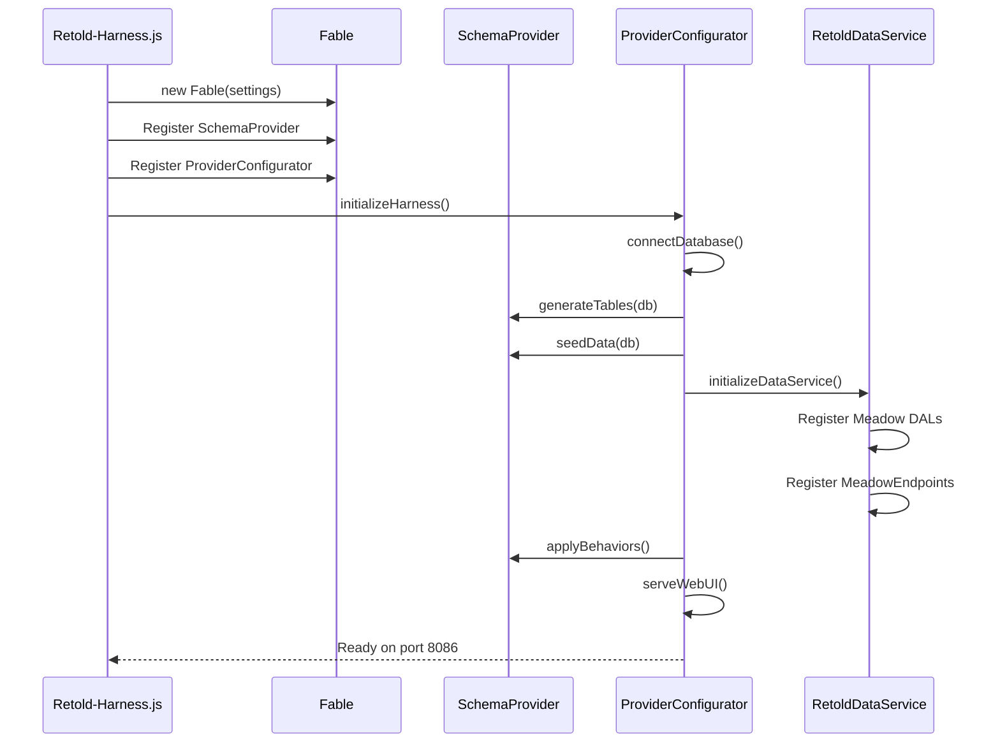
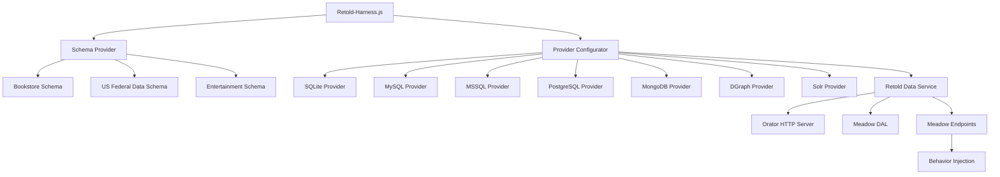

# Architecture

## System Design

The retold-harness uses a composable architecture where **schemas** and **providers** are independent, interchangeable components connected through Fable's service injection. This separation allows any schema to run against any storage provider without either component knowing the specifics of the other.

The two axes of composition are:

- **Schema Providers** define _what_ data exists: table structures, seed data, and endpoint behaviors. Each schema is a self-contained package with DDL, JSON schema files, and a service class.
- **Provider Configurators** define _how_ data is stored: database connection logic, DDL execution strategy, and seed loading mechanics. Each provider wraps a `meadow-connection-*` module.

At startup, `Retold-Harness.js` reads two environment variables (`HARNESS_SCHEMA` and `HARNESS_PROVIDER`), looks up the corresponding classes in its maps, registers them as Fable services, and hands control to the provider configurator's `initializeHarness()` method. From that point forward, the provider configurator orchestrates a six-stage lifecycle through Anticipate (Fable's async waterfall utility).

## Initialization Flow



### Step-by-step walkthrough

1. `Retold-Harness.js` reads `HARNESS_SCHEMA` (default: `bookstore`) and `HARNESS_PROVIDER` (default: `sqlite`).
2. It looks up the configuration module for the selected schema (e.g. `configuration-bookstore-serve-api.js`) to build the Fable settings object, which includes connection credentials for every supported provider.
3. A new `Fable` instance is created with those settings.
4. The selected schema class is registered as `HarnessSchemaProvider` and the selected provider class is registered as `MeadowProviderConfigurator`, both via `fable.serviceManager`.
5. `initializeHarness()` is called on the provider configurator, which chains the lifecycle stages through Anticipate.

## Component Architecture



The top-level entry point (`Retold-Harness.js`) holds two lookup maps:

- `_SchemaMap` -- maps schema keys (`bookstore`, `us-federal-data`, `entertainment`) to their service classes.
- `_ProviderMap` -- maps provider keys (`sqlite`, `mysql`, `mssql`, `postgresql`, `mongodb`, `dgraph`, `solr`) to their service classes.

A separate `_ConfigMap` maps schema keys to their configuration modules, which export the full Fable settings object including connection credentials for all providers.

## Lifecycle Stages

The provider configurator's `initializeHarness()` method chains six stages via Anticipate. Each stage receives a callback and must call it to advance to the next stage. If any stage passes an error, the chain aborts.

### 1. connectDatabase

Registers the appropriate `meadow-connection-*` module as a Fable service and opens a connection to the database engine. For SQLite this means ensuring the data directory exists and calling `connectAsync()`. For networked providers (MySQL, MSSQL, PostgreSQL, etc.) this creates a connection pool using credentials from the settings object.

### 2. initializeSchema

Passes the database handle to the schema provider's `generateTables()` and `seedData()` methods. The exact mechanism varies by provider:

- **SQLite** passes the raw `better-sqlite3` database handle, and the schema provider executes SQL files synchronously.
- **MySQL** uses the connection module's `createTables()` method against `Schema.json`, then runs seed SQL statements sequentially through the pool.
- Other providers follow similar patterns appropriate to their connection modules.

### 3. initializeDataService

Creates and initializes a `RetoldDataService` instance. The schema provider's `getRetoldDataServiceOptions()` method builds the options object, specifying the storage provider name, module name, schema file path, and schema filename. `RetoldDataService` reads `Schema.json`, creates Meadow DAL instances for every entity, and registers `MeadowEndpoints` that expose REST routes through the Orator HTTP server.

### 4. applyBehaviors

Delegates to the schema provider's `applyBehaviors()` method. This is where schemas install endpoint behavior hooks -- post-operation behaviors that enrich read responses with data from related entities. For example, the Bookstore schema's `Read-PostOperation` behavior on the `Book` endpoint joins author records into the response.

### 5. serveWebUI

Reads `source/web/index.html` and registers a GET handler at `/` on the Orator HTTP server. This provides a simple landing page for the running harness instance.

### 6. Ready

Logs the startup message with the API server port and web UI URL.

## Service Registration

Retold-harness relies on Fable's service manager to wire components together at runtime. The two key service types are:

### HarnessSchemaProvider

Registered via:

```javascript
_Fable.serviceManager.addServiceType('HarnessSchemaProvider', _SchemaMap[tmpSchemaKey]);
_Fable.serviceManager.instantiateServiceProvider('HarnessSchemaProvider');
```

After registration, the schema provider is available as `_Fable.HarnessSchemaProvider`. Concrete schema classes extend `Retold-Harness-Service-SchemaProvider.js` and must set `this.serviceType = 'HarnessSchemaProvider'` in their constructor.

### MeadowProviderConfigurator

Registered via:

```javascript
_Fable.serviceManager.addServiceType('MeadowProviderConfigurator', _ProviderMap[tmpProviderKey]);
_Fable.serviceManager.instantiateServiceProvider('MeadowProviderConfigurator');
```

After registration, the provider configurator is available as `_Fable.MeadowProviderConfigurator`. Concrete provider classes extend `Retold-Harness-Service-MeadowProviderConfigurator.js` and must set `this.serviceType = 'MeadowProviderConfigurator'` in their constructor.

### Additional Services

During initialization, the provider configurator registers further services:

- A `meadow-connection-*` provider (e.g. `MeadowSQLiteProvider`, `MeadowMySQLProvider`)
- `RetoldDataService` -- the Retold data layer that creates DALs and endpoints
- `OratorServiceServer` -- the HTTP server (registered internally by RetoldDataService)
- `MeadowEndpoints.*` -- per-entity endpoint controllers (registered internally)
- `DAL.*` -- per-entity Meadow data access layers (registered internally)

## Environment Variable Selection

Two environment variables control which schema and provider are used at startup:

| Variable | Default | Values |
|----------|---------|--------|
| `HARNESS_SCHEMA` | `bookstore` | `bookstore`, `us-federal-data`, `entertainment` |
| `HARNESS_PROVIDER` | `sqlite` | `sqlite`, `mysql`, `mssql`, `postgresql`, `mongodb`, `dgraph`, `solr` |

The `PORT` environment variable sets the API server port (default: `8086`).

Usage examples:

```bash
# Default: bookstore schema on SQLite
npm start

# Bookstore schema on MySQL
HARNESS_SCHEMA=bookstore HARNESS_PROVIDER=mysql npm start

# US Federal Data schema on PostgreSQL, custom port
HARNESS_SCHEMA=us-federal-data HARNESS_PROVIDER=postgresql PORT=9000 npm start

# Entertainment schema on SQLite
HARNESS_SCHEMA=entertainment npm start
```

Each schema's configuration module (`configuration-*-serve-api.js`) also reads provider-specific environment variables for connection credentials. For example, the MySQL section reads `MYSQL_HOST`, `MYSQL_PORT`, `MYSQL_USER`, `MYSQL_PASSWORD`, and `MYSQL_DATABASE`. See the [Configuration](configuration.md) documentation for details.
